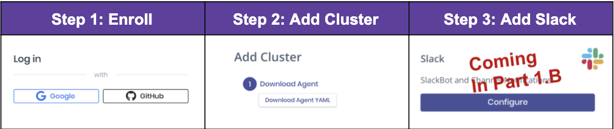

# Quick Start Onboarding Guide 1a - Real-Time Kubernetes Inventory

## A Note from our CEO

As a CISO, my nightmare was the “knowable unknowns.”  It’s the thing I should’ve known about, could’ve known about, but didn’t – until it was too late.  

Perhaps it was an externally facing service. Maybe it was a patch that never got rolled out.  Or maybe it was the new application processing millions of dollars in revenue that got past security.  

In each of these cases someone on my team should have known about this but they didn’t.  And now it’s all my fault – I’m absolutely accountable.

And now I have Kubernetes...good luck! Developers are spinning up clusters, microservices and whole applications. My teams and I are the last to know...or are we? 

This 2 minute quick start guide will allow you (the CISO) to:
- On-board to Soluble
- Get Real-time visibility into your Kubernetes inventory
- All of it delivered to you in real-time via Slack (part b)

-- _Rich Seiersen, CEO and Co-Founder, Soluble_

# Getting Started

1.  _5 seconds_. That’s how long it takes to become a user
1.  _20 seconds_. That’s how long it takes to add a Cluster to Soluble and start streaming real-time inventory to our platform
1.  _5 seconds_. That’s all it takes to enable Slack alerting (part b)

## Step 1: Enroll in 5 seconds
-  Open a browser to https://app.soluble.cloud/
-  Click Register 
-  Select Google or GitHub 
-  Select your account
-  Done!

## Step 2: Add a cluster in 20 seconds
-  Click Add Cluster  
-  Follow Instructions (or punt to a friend - see below)

Punt: If you don’t have access to a cluster, but know who does, scroll down to the “Add User” section below. They add, you get all the visibility!

Congratulations! You just onboarded and added your first cluster to Soluble! Take a look around.  Click on Analytics and look at reports, explore integrations etc.

As developers spin up hundreds of clusters running thousands of nodes across multiple clouds - you’re on your way to real-time visibility! 

This is the first of a dozen quick start guides.  Next up - enabling Slack alerts using Soluble Playbooks.
We can’t wait to see what you operationalize next with Soluble!

## Add User
You don’t have access to clusters? No problem!  Send an invite to folks on your teams, and give them the permissions to drop soluble in clusters.

-  Click on Settings on the left. 
-  Then select Users (highlighted below). 
-  Then click the “Invite Users” button on the top right.  
-  Then enter email and give them “write” permissions

